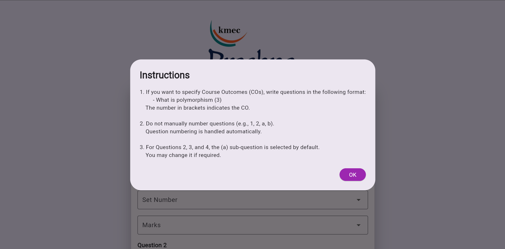
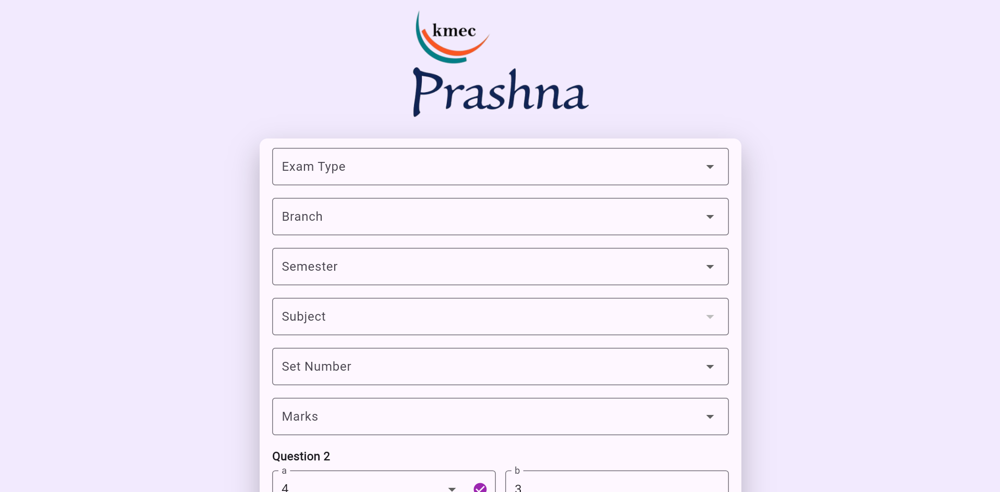
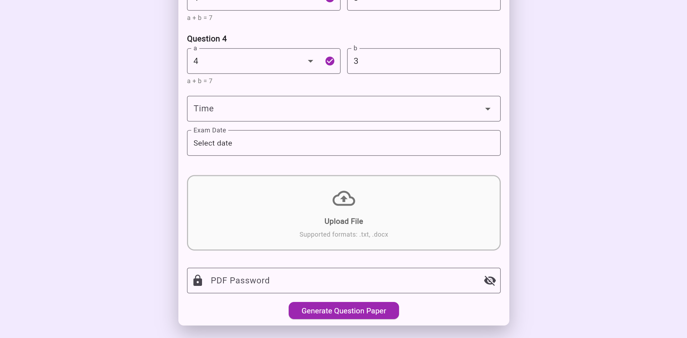

# Question Paper Automation Tool (QPAT)

> AI-Assisted Academic Assessment Automation System for Semantic Question Analysis, Bloom's Taxonomy Classification, Automated Question Paper Generation, and Examination Workflow Automation.

---

## 📌 Overview

Question Paper Automation Tool (QPAT) is a full-stack academic assessment automation platform designed to streamline and accelerate the creation of university-compliant question papers.

The platform combines Natural Language Processing (NLP), semantic text analysis, automated formatting, and document generation to reduce faculty workload while ensuring consistency, accuracy, and compliance with institutional examination standards.

Using Sentence Transformers, QPAT performs semantic analysis of examination questions to better understand question intent and support Bloom's Taxonomy-based cognitive level classification. The generated question papers are formatted automatically, converted into secure PDF documents, and submitted to the Examination Branch through an automated workflow.

---

## 🏛️ Institutional Application

Developed as an academic workflow automation solution to assist faculty members in preparing and submitting examination question papers efficiently, QPAT standardizes assessment creation while reducing administrative overhead and manual processing effort.

---

## 🎯 Problem Statement

Preparing examination question papers manually is often time-consuming, repetitive, and prone to formatting inconsistencies. Faculty members must spend significant effort organizing questions, validating formats, ensuring compliance with university guidelines, generating final documents, and coordinating submission procedures.

QPAT addresses these challenges by automating the complete question paper preparation workflow, enabling faster, more reliable, and standardized assessment creation.

---

## ✨ Key Features

* Automated question paper generation from uploaded question banks
* Semantic understanding of questions using Sentence Transformers
* AI-assisted analysis of question intent and cognitive level
* Bloom's Taxonomy-based cognitive level classification
* Intelligent question validation and formatting
* Automated question arrangement based on examination structure
* Dynamic template-driven paper generation
* University-compliant question paper formatting
* Secure PDF generation with password protection
* User-friendly web interface
* Real-time processing and output generation
* Automated submission of generated question papers to the Examination Branch
* End-to-end academic assessment workflow automation
* Reduced manual intervention and human error

---

## 🤖 AI & NLP Capabilities

QPAT leverages Natural Language Processing techniques to improve academic content analysis and assessment preparation.

### Core Capabilities

* Semantic analysis of examination questions using Sentence Transformers
* Context-aware understanding of question intent
* Bloom's Taxonomy cognitive level classification
* Text preprocessing and validation
* Academic content standardization
* Similarity-based question analysis
* Automated assessment document preparation

---

## 🎓 Use Case

QPAT is designed for educational institutions seeking to automate the assessment preparation process.

The platform enables faculty members to generate standardized question papers quickly while ensuring compliance with examination guidelines and simplifying communication with the Examination Branch through automated document submission workflows.

---

## ⚙️ System Workflow

1. Upload a question bank file (.txt or .docx)
2. Configure examination details:

   * Examination Type
   * Subject
   * Branch
   * Semester
   * Duration
   * Maximum Marks
   * Set Number
3. Validate and preprocess uploaded questions
4. Perform semantic analysis using Sentence Transformers
5. Map questions to Bloom's Taxonomy cognitive levels
6. Organize questions according to the required examination structure
7. Generate a university-compliant question paper
8. Create a password-protected PDF document
9. Automatically submit the generated question paper to the Examination Branch
10. Complete the assessment preparation workflow

---

## 🛠️ Technology Stack

### Frontend

* Flutter Web

### Backend

* FastAPI
* Python

### AI & Natural Language Processing

* Sentence Transformers
* spaCy
* SymSpell

### Document Processing

* ReportLab
* python-docx

### Database

* SQLite

### Additional Components

* REST APIs
* PDF Security & Protection
* Template-Based Document Generation

---

## 🎯 Project Outcomes

* Automated the end-to-end question paper preparation workflow
* Reduced faculty effort involved in question paper creation and formatting
* Improved consistency and compliance with university examination standards
* Enabled automated submission of generated papers to the Examination Branch
* Minimized formatting and structural errors in examination papers
* Accelerated assessment preparation and approval processes
* Streamlined academic assessment management
* Enhanced question analysis through semantic understanding

---

## 📸 Screenshots

### Home Screen

### Examination Configuration

### Question Paper Preview

📄 [Input_Questions.txt](Input_Questions.txt)

### Generated Output

📄 [Generated_Output.pdf](Generated_Output.pdf)

---

## ▶️ Demo Video

Watch the project demonstration:

🎥 [Watch Project Demo](https://youtu.be/nXAxIQkd4dc)

Alternatively, the demonstration video can be hosted on YouTube and linked here.

---

## 🔮 Future Enhancements

* Advanced NLP-based question quality analysis
* AI-assisted question recommendation and generation
* Multi-university template support
* Faculty authentication and role-based access control
* Cloud deployment and centralized management
* Examination analytics dashboard
* Assessment history and audit tracking
* Integration with institutional ERP systems
* Automated syllabus coverage analysis
* Learning Outcome (LO) and Course Outcome (CO) mapping

---

## 📂 Repository Information

This repository serves as a project showcase containing documentation, architecture diagrams, screenshots, and demonstration materials.

Source code is not publicly available.

---
## 👥 Project Team

Developed by:

- Abhishek Mathpati
- Mythreie Dumpati

Department of Computer Science & Engineering  
Keshav Memorial Engineering College
